# Retrieve eval — filter benches (2026-05-23 snapshot)

## Summary

- Sources: 6 aggregated bundles in `results/{arxiv,goodreads}/d{64,128,256}-filter.json`.
- Algos: `linr_v1`, `linr_v2`, `linr_v3`, `linr_v4`, `silvertorch`.
- Filters: `clause`, `bloom`; sweeps cover a wide selectivity range (see per-dataset tables).
- Tables aggregate over filter sweeps **within a selectivity tier** at bs=8, k=100. ★ = Pareto-optimal on (p50 latency ↓, recall ↑) within filter_kind.
- Selectivity tiers (% items kept by predicate): **high** = strict (<5%), **mid** = 5–25%, **low** = loose (≥25%). Computed empirically from `item_attrs_narrow.pt` (see `compute_selectivity.py`).

## Cross-dim scaling

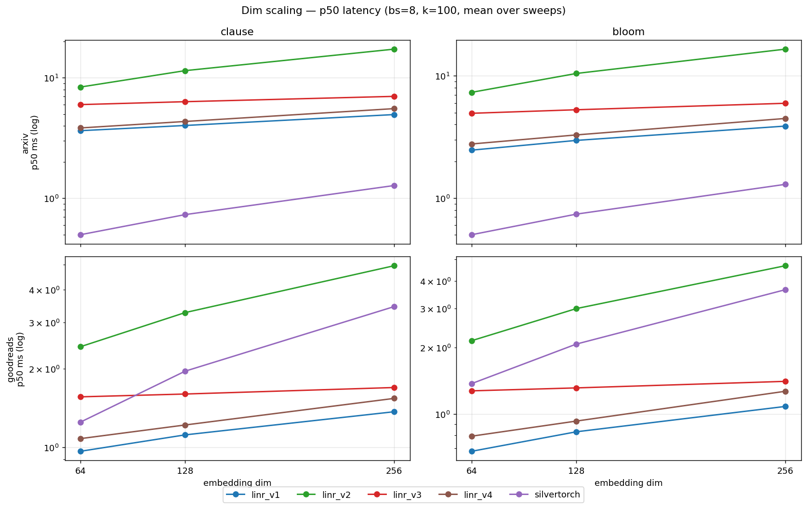

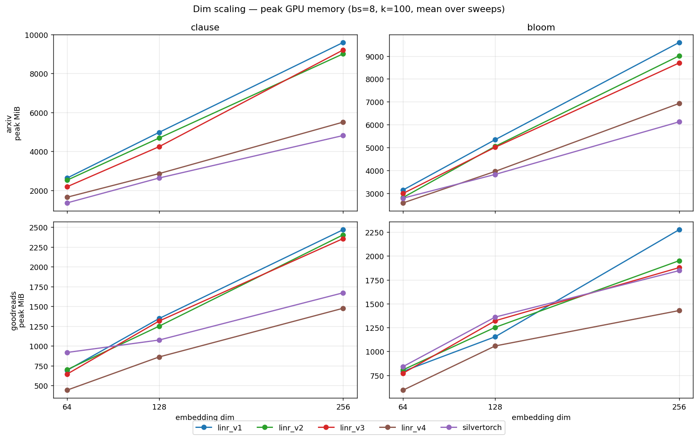

## arxiv

### Selectivity per sweep

| sweep | selectivity_% | n_clauses | tier |
| --- | --- | --- | --- |
| all4 | 0.8680 | 4 | high |
| c0c2 | 3.6980 | 2 | high |
| c0_maincat | 13.2620 | 1 | mid |
| c2_year | 23.5650 | 1 | mid |
| c3_nversions | 44.6150 | 1 | low |

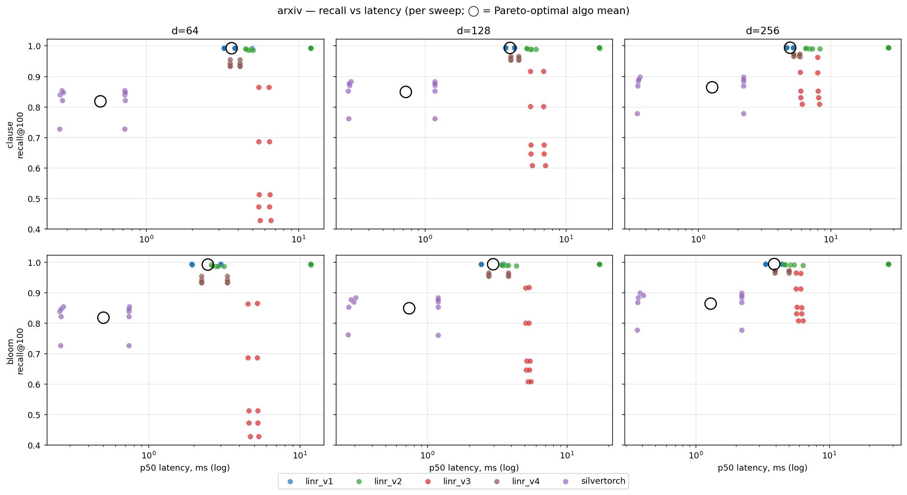
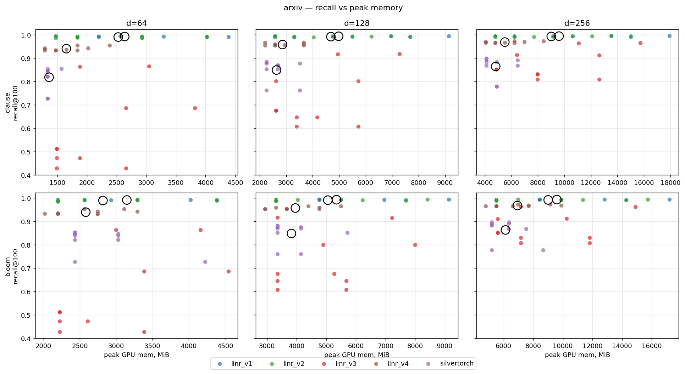
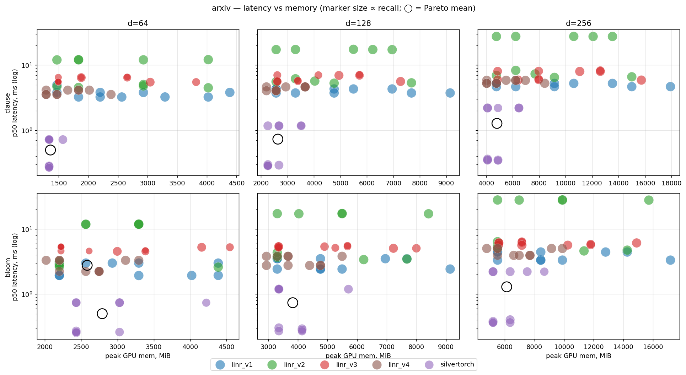
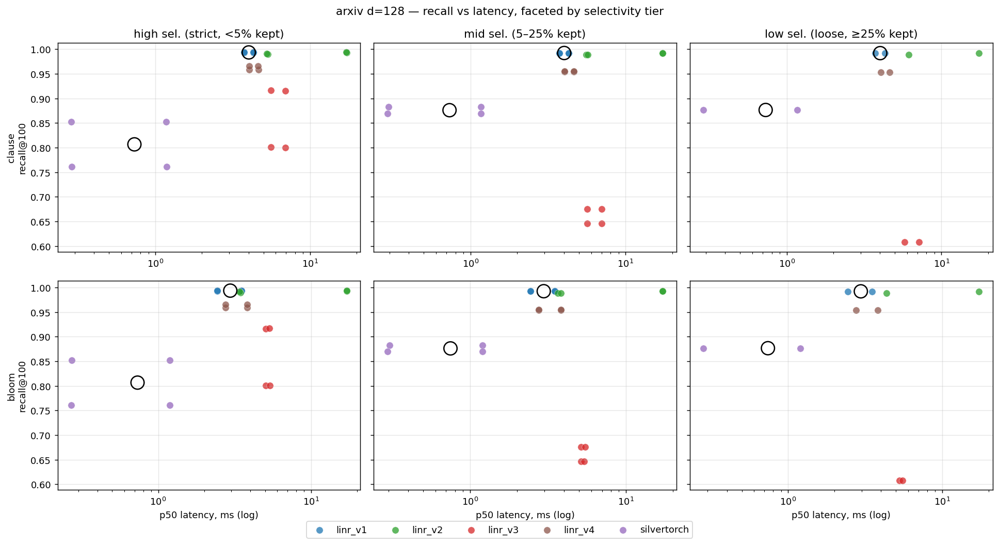
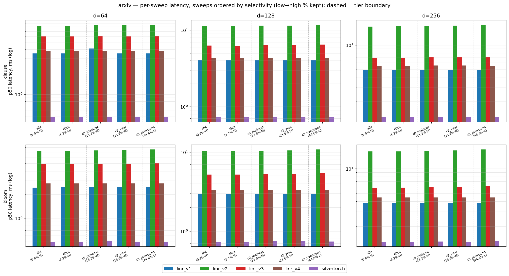

### arxiv · d=64 — by selectivity tier

#### high sel. (strict, <5% kept) — sweeps: `all4` (0.9%), `c0c2` (3.7%)

- **clause** — fastest: `silvertorch` (0.50 ms); best recall: `linr_v1` (0.9927); lowest peak mem: `silvertorch` (1336.5 MiB); Pareto: linr_v1, silvertorch.
- **bloom** — fastest: `silvertorch` (0.50 ms); best recall: `linr_v1` (0.9927); lowest peak mem: `linr_v4` (2928.8 MiB); Pareto: linr_v1, silvertorch.

| filter | algo | recall | ndcg | p50_ms | peak_MiB | idx_MiB | pareto |
| --- | --- | --- | --- | --- | --- | --- | --- |
| clause | silvertorch | 0.7740 | 0.8278 | 0.4974 | 1336.5 | 240.7 | ★ |
| clause | linr_v1 | 0.9927 | 0.9948 | 3.5226 | 2745.8 | 364.9 | ★ |
| clause | linr_v4 | 0.9482 | 0.9621 | 3.8340 | 1879.5 | 182.5 |  |
| clause | linr_v3 | 0.7752 | 0.8300 | 5.9523 | 2849.1 | 387.8 |  |
| clause | linr_v2 | 0.9908 | 0.9934 | 8.2665 | 2563.5 | 364.9 |  |
| bloom | silvertorch | 0.7741 | 0.8278 | 0.5009 | 3028.4 | 605.5 | ★ |
| bloom | linr_v1 | 0.9927 | 0.9948 | 2.4653 | 3475.8 | 364.9 | ★ |
| bloom | linr_v4 | 0.9482 | 0.9621 | 2.7708 | 2928.8 | 182.4 |  |
| bloom | linr_v3 | 0.7752 | 0.8300 | 4.8889 | 3772.5 | 387.7 |  |
| bloom | linr_v2 | 0.9908 | 0.9934 | 7.2117 | 3110.7 | 364.9 |  |

#### mid sel. (5–25% kept) — sweeps: `c0_maincat` (13.3%), `c2_year` (23.6%)

- **clause** — fastest: `silvertorch` (0.50 ms); best recall: `linr_v1` (0.9910); lowest peak mem: `silvertorch` (1394.5 MiB); Pareto: linr_v1, silvertorch.
- **bloom** — fastest: `silvertorch` (0.50 ms); best recall: `linr_v1` (0.9910); lowest peak mem: `linr_v4` (2290.2 MiB); Pareto: linr_v1, silvertorch.

| filter | algo | recall | ndcg | p50_ms | peak_MiB | idx_MiB | pareto |
| --- | --- | --- | --- | --- | --- | --- | --- |
| clause | silvertorch | 0.8465 | 0.8854 | 0.4966 | 1394.5 | 238.6 | ★ |
| clause | linr_v1 | 0.9910 | 0.9936 | 3.8117 | 2289.7 | 364.9 | ★ |
| clause | linr_v4 | 0.9345 | 0.9519 | 3.8351 | 1423.4 | 182.6 |  |
| clause | linr_v3 | 0.4927 | 0.6029 | 5.9876 | 1588.8 | 387.9 |  |
| clause | linr_v2 | 0.9885 | 0.9918 | 8.3966 | 2016.3 | 365.0 |  |
| bloom | silvertorch | 0.8465 | 0.8854 | 0.5035 | 2580.5 | 605.6 | ★ |
| bloom | linr_v1 | 0.9910 | 0.9936 | 2.4679 | 2563.6 | 364.9 | ★ |
| bloom | linr_v4 | 0.9345 | 0.9519 | 2.7702 | 2290.2 | 182.4 |  |
| bloom | linr_v3 | 0.4927 | 0.6030 | 4.9350 | 2318.4 | 387.8 |  |
| bloom | linr_v2 | 0.9885 | 0.9917 | 7.3384 | 2563.4 | 364.9 |  |

#### low sel. (loose, ≥25% kept) — sweeps: `c3_nversions` (44.6%)

- **clause** — fastest: `silvertorch` (0.50 ms); best recall: `linr_v1` (0.9908); lowest peak mem: `silvertorch` (1336.4 MiB); Pareto: linr_v1, silvertorch.
- **bloom** — fastest: `silvertorch` (0.50 ms); best recall: `linr_v1` (0.9908); lowest peak mem: `linr_v4` (2472.7 MiB); Pareto: linr_v1, silvertorch.

| filter | algo | recall | ndcg | p50_ms | peak_MiB | idx_MiB | pareto |
| --- | --- | --- | --- | --- | --- | --- | --- |
| clause | silvertorch | 0.8468 | 0.8860 | 0.5028 | 1336.4 | 240.6 | ★ |
| clause | linr_v1 | 0.9908 | 0.9934 | 3.5242 | 3110.6 | 364.9 | ★ |
| clause | linr_v4 | 0.9327 | 0.9506 | 3.8340 | 1651.4 | 182.4 |  |
| clause | linr_v3 | 0.4283 | 0.5467 | 6.0770 | 2073.4 | 387.8 |  |
| clause | linr_v2 | 0.9882 | 0.9915 | 8.5804 | 3475.8 | 364.9 |  |
| bloom | silvertorch | 0.8467 | 0.8859 | 0.5020 | 2729.6 | 605.4 | ★ |
| bloom | linr_v1 | 0.9908 | 0.9934 | 2.4697 | 3658.2 | 364.9 | ★ |
| bloom | linr_v4 | 0.9327 | 0.9506 | 2.7718 | 2472.7 | 182.4 |  |
| bloom | linr_v3 | 0.4283 | 0.5467 | 5.0335 | 2803.1 | 387.8 |  |
| bloom | linr_v2 | 0.9882 | 0.9915 | 7.5310 | 2745.8 | 364.9 |  |

Per-sweep detail (bs=8, k=100)

| filter | sweep | tier | sel_pct | algo | recall | p50_ms | peak_MiB |
| --- | --- | --- | --- | --- | --- | --- | --- |
| clause | all4 | high | 0.8700 | linr_v1 | 0.9935 | 3.5245 | 2016.0 |
| clause | all4 | high | 0.8700 | linr_v2 | 0.9918 | 8.2477 | 2745.9 |
| clause | all4 | high | 0.8700 | linr_v3 | 0.8642 | 5.9478 | 2461.3 |
| clause | all4 | high | 0.8700 | linr_v4 | 0.9541 | 3.8346 | 2107.7 |
| clause | all4 | high | 0.8700 | silvertorch | 0.7270 | 0.4940 | 1336.4 |
| clause | c0c2 | high | 3.7000 | linr_v1 | 0.9920 | 3.5206 | 3475.5 |
| clause | c0c2 | high | 3.7000 | linr_v2 | 0.9898 | 8.2853 | 2381.2 |
| clause | c0c2 | high | 3.7000 | linr_v3 | 0.6863 | 5.9569 | 3236.9 |
| clause | c0c2 | high | 3.7000 | linr_v4 | 0.9423 | 3.8334 | 1651.3 |
| clause | c0c2 | high | 3.7000 | silvertorch | 0.8211 | 0.5007 | 1336.6 |
| clause | c0_maincat | mid | 13.2600 | linr_v1 | 0.9909 | 4.0991 | 1833.6 |
| clause | c0_maincat | mid | 13.2600 | linr_v2 | 0.9883 | 8.3795 | 1651.4 |
| clause | c0_maincat | mid | 13.2600 | linr_v3 | 0.5126 | 5.9949 | 1491.9 |
| clause | c0_maincat | mid | 13.2600 | linr_v4 | 0.9332 | 3.8357 | 1377.8 |
| clause | c0_maincat | mid | 13.2600 | silvertorch | 0.8537 | 0.4988 | 1452.6 |
| clause | c2_year | mid | 23.5600 | linr_v1 | 0.9912 | 3.5242 | 2745.8 |
| clause | c2_year | mid | 23.5600 | linr_v2 | 0.9888 | 8.4136 | 2381.2 |
| clause | c2_year | mid | 23.5600 | linr_v3 | 0.4729 | 5.9804 | 1685.6 |
| clause | c2_year | mid | 23.5600 | linr_v4 | 0.9357 | 3.8345 | 1469.0 |
| clause | c2_year | mid | 23.5600 | silvertorch | 0.8394 | 0.4943 | 1336.4 |
| clause | c3_nversions | low | 44.6200 | linr_v1 | 0.9908 | 3.5242 | 3110.6 |
| clause | c3_nversions | low | 44.6200 | linr_v2 | 0.9882 | 8.5804 | 3475.8 |
| clause | c3_nversions | low | 44.6200 | linr_v3 | 0.4283 | 6.0770 | 2073.4 |
| clause | c3_nversions | low | 44.6200 | linr_v4 | 0.9327 | 3.8340 | 1651.4 |
| clause | c3_nversions | low | 44.6200 | silvertorch | 0.8468 | 0.5028 | 1336.4 |
| bloom | all4 | high | 0.8700 | linr_v1 | 0.9935 | 2.4643 | 3840.7 |
| bloom | all4 | high | 0.8700 | linr_v2 | 0.9918 | 7.1958 | 3475.5 |
| bloom | all4 | high | 0.8700 | linr_v3 | 0.8641 | 4.8890 | 3578.6 |
| bloom | all4 | high | 0.8700 | linr_v4 | 0.9541 | 2.7701 | 2837.6 |
| bloom | all4 | high | 0.8700 | silvertorch | 0.7271 | 0.5003 | 3327.0 |
| bloom | c0c2 | high | 3.7000 | linr_v1 | 0.9920 | 2.4664 | 3110.9 |
| bloom | c0c2 | high | 3.7000 | linr_v2 | 0.9899 | 7.2276 | 2745.8 |
| bloom | c0c2 | high | 3.7000 | linr_v3 | 0.6862 | 4.8888 | 3966.4 |
| bloom | c0c2 | high | 3.7000 | linr_v4 | 0.9423 | 2.7715 | 3020.0 |
| bloom | c0c2 | high | 3.7000 | silvertorch | 0.8211 | 0.5015 | 2729.7 |
| bloom | c0_maincat | mid | 13.2600 | linr_v1 | 0.9909 | 2.4656 | 2381.2 |
| bloom | c0_maincat | mid | 13.2600 | linr_v2 | 0.9883 | 7.3190 | 2380.9 |
| bloom | c0_maincat | mid | 13.2600 | linr_v3 | 0.5126 | 4.9401 | 2221.4 |
| bloom | c0_maincat | mid | 13.2600 | linr_v4 | 0.9332 | 2.7693 | 2381.5 |
| bloom | c0_maincat | mid | 13.2600 | silvertorch | 0.8536 | 0.5079 | 2431.0 |
| bloom | c2_year | mid | 23.5600 | linr_v1 | 0.9912 | 2.4701 | 2746.1 |
| bloom | c2_year | mid | 23.5600 | linr_v2 | 0.9888 | 7.3578 | 2745.8 |
| bloom | c2_year | mid | 23.5600 | linr_v3 | 0.4729 | 4.9299 | 2415.4 |
| bloom | c2_year | mid | 23.5600 | linr_v4 | 0.9357 | 2.7711 | 2199.0 |
| bloom | c2_year | mid | 23.5600 | silvertorch | 0.8394 | 0.4991 | 2730.0 |
| bloom | c3_nversions | low | 44.6200 | linr_v1 | 0.9908 | 2.4697 | 3658.2 |
| bloom | c3_nversions | low | 44.6200 | linr_v2 | 0.9882 | 7.5310 | 2745.8 |
| bloom | c3_nversions | low | 44.6200 | linr_v3 | 0.4283 | 5.0335 | 2803.1 |
| bloom | c3_nversions | low | 44.6200 | linr_v4 | 0.9327 | 2.7718 | 2472.7 |
| bloom | c3_nversions | low | 44.6200 | silvertorch | 0.8467 | 0.5020 | 2729.6 |

### arxiv · d=128 — by selectivity tier

#### high sel. (strict, <5% kept) — sweeps: `all4` (0.9%), `c0c2` (3.7%)

- **clause** — fastest: `silvertorch` (0.73 ms); best recall: `linr_v1` (0.9935); lowest peak mem: `silvertorch` (2679.4 MiB); Pareto: linr_v1, silvertorch.
- **bloom** — fastest: `silvertorch` (0.73 ms); best recall: `linr_v1` (0.9935); lowest peak mem: `silvertorch` (4139.3 MiB); Pareto: linr_v1, silvertorch.

| filter | algo | recall | ndcg | p50_ms | peak_MiB | idx_MiB | pareto |
| --- | --- | --- | --- | --- | --- | --- | --- |
| clause | silvertorch | 0.8067 | 0.8532 | 0.7303 | 2679.4 | 427.0 | ★ |
| clause | linr_v1 | 0.9935 | 0.9953 | 4.0181 | 5856.9 | 730.0 | ★ |
| clause | linr_v4 | 0.9621 | 0.9724 | 4.3379 | 3028.1 | 365.0 |  |
| clause | linr_v3 | 0.8585 | 0.8948 | 6.2707 | 5137.9 | 775.5 |  |
| clause | linr_v2 | 0.9920 | 0.9943 | 11.2827 | 5491.9 | 730.0 |  |
| bloom | silvertorch | 0.8067 | 0.8532 | 0.7321 | 4139.3 | 791.7 | ★ |
| bloom | linr_v1 | 0.9935 | 0.9953 | 2.9632 | 6404.1 | 730.0 | ★ |
| bloom | linr_v4 | 0.9621 | 0.9724 | 3.2852 | 4487.9 | 365.0 |  |
| bloom | linr_v3 | 0.8585 | 0.8948 | 5.2043 | 5867.8 | 775.5 |  |
| bloom | linr_v2 | 0.9920 | 0.9943 | 10.2642 | 6586.6 | 730.0 |  |

#### mid sel. (5–25% kept) — sweeps: `c0_maincat` (13.3%), `c2_year` (23.6%)

- **clause** — fastest: `silvertorch` (0.73 ms); best recall: `linr_v1` (0.9923); lowest peak mem: `silvertorch` (2470.2 MiB); Pareto: linr_v1, silvertorch.
- **bloom** — fastest: `silvertorch` (0.75 ms); best recall: `linr_v1` (0.9923); lowest peak mem: `linr_v4` (3301.5 MiB); Pareto: linr_v1, silvertorch.

| filter | algo | recall | ndcg | p50_ms | peak_MiB | idx_MiB | pareto |
| --- | --- | --- | --- | --- | --- | --- | --- |
| clause | silvertorch | 0.8761 | 0.9080 | 0.7327 | 2470.2 | 424.9 | ★ |
| clause | linr_v1 | 0.9923 | 0.9945 | 4.0186 | 3301.9 | 730.0 | ★ |
| clause | linr_v4 | 0.9546 | 0.9670 | 4.3385 | 2571.6 | 364.9 |  |
| clause | linr_v3 | 0.6609 | 0.7421 | 6.3299 | 3199.0 | 775.5 |  |
| clause | linr_v2 | 0.9905 | 0.9932 | 11.4740 | 4031.9 | 730.0 |  |
| bloom | silvertorch | 0.8761 | 0.9080 | 0.7475 | 3551.9 | 791.8 | ★ |
| bloom | linr_v1 | 0.9923 | 0.9945 | 2.9631 | 3666.6 | 730.0 | ★ |
| bloom | linr_v4 | 0.9546 | 0.9670 | 3.2856 | 3301.5 | 365.0 |  |
| bloom | linr_v3 | 0.6609 | 0.7421 | 5.2783 | 4407.9 | 775.6 |  |
| bloom | linr_v2 | 0.9905 | 0.9932 | 10.4490 | 3849.1 | 730.0 |  |

#### low sel. (loose, ≥25% kept) — sweeps: `c3_nversions` (44.6%)

- **clause** — fastest: `silvertorch` (0.73 ms); best recall: `linr_v1` (0.9921); lowest peak mem: `silvertorch` (2888.9 MiB); Pareto: linr_v1, silvertorch.
- **bloom** — fastest: `silvertorch` (0.74 ms); best recall: `linr_v1` (0.9921); lowest peak mem: `silvertorch` (3747.5 MiB); Pareto: linr_v1, silvertorch.

| filter | algo | recall | ndcg | p50_ms | peak_MiB | idx_MiB | pareto |
| --- | --- | --- | --- | --- | --- | --- | --- |
| clause | silvertorch | 0.8766 | 0.9087 | 0.7305 | 2888.9 | 427.1 | ★ |
| clause | linr_v1 | 0.9921 | 0.9943 | 4.0184 | 6586.9 | 730.0 | ★ |
| clause | linr_v4 | 0.9534 | 0.9660 | 4.3387 | 3119.2 | 364.9 |  |
| clause | linr_v3 | 0.6077 | 0.6991 | 6.4643 | 4556.4 | 775.6 |  |
| clause | linr_v2 | 0.9902 | 0.9930 | 11.7982 | 4396.9 | 730.0 |  |
| bloom | silvertorch | 0.8766 | 0.9087 | 0.7390 | 3747.5 | 791.7 | ★ |
| bloom | linr_v1 | 0.9921 | 0.9943 | 2.9617 | 6586.6 | 730.0 | ★ |
| bloom | linr_v4 | 0.9534 | 0.9660 | 3.2847 | 4214.3 | 365.1 |  |
| bloom | linr_v3 | 0.6077 | 0.6991 | 5.4146 | 4510.5 | 775.6 |  |
| bloom | linr_v2 | 0.9902 | 0.9930 | 10.8070 | 4396.6 | 730.0 |  |

Per-sweep detail (bs=8, k=100)

| filter | sweep | tier | sel_pct | algo | recall | p50_ms | peak_MiB |
| --- | --- | --- | --- | --- | --- | --- | --- |
| clause | all4 | high | 0.8700 | linr_v1 | 0.9940 | 4.0182 | 8046.9 |
| clause | all4 | high | 0.8700 | linr_v2 | 0.9927 | 11.2573 | 5856.9 |
| clause | all4 | high | 0.8700 | linr_v3 | 0.9164 | 6.2768 | 6107.3 |
| clause | all4 | high | 0.8700 | linr_v4 | 0.9654 | 4.3373 | 2937.0 |
| clause | all4 | high | 0.8700 | silvertorch | 0.7611 | 0.7323 | 2888.9 |
| clause | c0c2 | high | 3.7000 | linr_v1 | 0.9930 | 4.0179 | 3666.9 |
| clause | c0c2 | high | 3.7000 | linr_v2 | 0.9913 | 11.3082 | 5126.9 |
| clause | c0c2 | high | 3.7000 | linr_v3 | 0.8005 | 6.2647 | 4168.4 |
| clause | c0c2 | high | 3.7000 | linr_v4 | 0.9587 | 4.3385 | 3119.2 |
| clause | c0c2 | high | 3.7000 | silvertorch | 0.8523 | 0.7283 | 2469.9 |
| clause | c0_maincat | mid | 13.2600 | linr_v1 | 0.9923 | 4.0186 | 2571.9 |
| clause | c0_maincat | mid | 13.2600 | linr_v2 | 0.9904 | 11.4512 | 2936.9 |
| clause | c0_maincat | mid | 13.2600 | linr_v3 | 0.6757 | 6.3296 | 2617.2 |
| clause | c0_maincat | mid | 13.2600 | linr_v4 | 0.9539 | 4.3389 | 2389.2 |
| clause | c0_maincat | mid | 13.2600 | silvertorch | 0.8828 | 0.7340 | 2260.8 |
| clause | c2_year | mid | 23.5600 | linr_v1 | 0.9924 | 4.0186 | 4031.9 |
| clause | c2_year | mid | 23.5600 | linr_v2 | 0.9906 | 11.4967 | 5126.9 |
| clause | c2_year | mid | 23.5600 | linr_v3 | 0.6461 | 6.3302 | 3780.8 |
| clause | c2_year | mid | 23.5600 | linr_v4 | 0.9554 | 4.3382 | 2754.0 |
| clause | c2_year | mid | 23.5600 | silvertorch | 0.8695 | 0.7314 | 2679.5 |
| clause | c3_nversions | low | 44.6200 | linr_v1 | 0.9921 | 4.0184 | 6586.9 |
| clause | c3_nversions | low | 44.6200 | linr_v2 | 0.9902 | 11.7982 | 4396.9 |
| clause | c3_nversions | low | 44.6200 | linr_v3 | 0.6077 | 6.4643 | 4556.4 |
| clause | c3_nversions | low | 44.6200 | linr_v4 | 0.9534 | 4.3387 | 3119.2 |
| clause | c3_nversions | low | 44.6200 | silvertorch | 0.8766 | 0.7305 | 2888.9 |
| bloom | all4 | high | 0.8700 | linr_v1 | 0.9940 | 2.9624 | 6951.6 |
| bloom | all4 | high | 0.8700 | linr_v2 | 0.9927 | 10.2394 | 7316.7 |
| bloom | all4 | high | 0.8700 | linr_v3 | 0.9164 | 5.1992 | 5286.1 |
| bloom | all4 | high | 0.8700 | linr_v4 | 0.9654 | 3.2848 | 4944.1 |
| bloom | all4 | high | 0.8700 | silvertorch | 0.7611 | 0.7314 | 3747.5 |
| bloom | c0c2 | high | 3.7000 | linr_v1 | 0.9930 | 2.9640 | 5856.6 |
| bloom | c0c2 | high | 3.7000 | linr_v2 | 0.9914 | 10.2889 | 5856.6 |
| bloom | c0c2 | high | 3.7000 | linr_v3 | 0.8006 | 5.2095 | 6449.4 |
| bloom | c0c2 | high | 3.7000 | linr_v4 | 0.9587 | 3.2856 | 4031.6 |
| bloom | c0c2 | high | 3.7000 | silvertorch | 0.8522 | 0.7328 | 4531.0 |
| bloom | c0_maincat | mid | 13.2600 | linr_v1 | 0.9923 | 2.9625 | 3301.6 |
| bloom | c0_maincat | mid | 13.2600 | linr_v2 | 0.9904 | 10.4204 | 3301.6 |
| bloom | c0_maincat | mid | 13.2600 | linr_v3 | 0.6757 | 5.2936 | 4305.3 |
| bloom | c0_maincat | mid | 13.2600 | linr_v4 | 0.9539 | 3.2861 | 2936.5 |
| bloom | c0_maincat | mid | 13.2600 | silvertorch | 0.8828 | 0.7501 | 3355.7 |
| bloom | c2_year | mid | 23.5600 | linr_v1 | 0.9924 | 2.9637 | 4031.6 |
| bloom | c2_year | mid | 23.5600 | linr_v2 | 0.9906 | 10.4775 | 4396.6 |
| bloom | c2_year | mid | 23.5600 | linr_v3 | 0.6461 | 5.2631 | 4510.5 |
| bloom | c2_year | mid | 23.5600 | linr_v4 | 0.9554 | 3.2850 | 3666.5 |
| bloom | c2_year | mid | 23.5600 | silvertorch | 0.8695 | 0.7448 | 3748.0 |
| bloom | c3_nversions | low | 44.6200 | linr_v1 | 0.9921 | 2.9617 | 6586.6 |
| bloom | c3_nversions | low | 44.6200 | linr_v2 | 0.9902 | 10.8070 | 4396.6 |
| bloom | c3_nversions | low | 44.6200 | linr_v3 | 0.6077 | 5.4146 | 4510.5 |
| bloom | c3_nversions | low | 44.6200 | linr_v4 | 0.9534 | 3.2847 | 4214.3 |
| bloom | c3_nversions | low | 44.6200 | silvertorch | 0.8766 | 0.7390 | 3747.5 |

### arxiv · d=256 — by selectivity tier

#### high sel. (strict, <5% kept) — sweeps: `all4` (0.9%), `c0c2` (3.7%)

- **clause** — fastest: `silvertorch` (1.27 ms); best recall: `linr_v1` (0.9939); lowest peak mem: `silvertorch` (5093.6 MiB); Pareto: linr_v1, silvertorch.
- **bloom** — fastest: `silvertorch` (1.29 ms); best recall: `linr_v1` (0.9939); lowest peak mem: `silvertorch` (6932.9 MiB); Pareto: linr_v1, silvertorch.

| filter | algo | recall | ndcg | p50_ms | peak_MiB | idx_MiB | pareto |
| --- | --- | --- | --- | --- | --- | --- | --- |
| clause | silvertorch | 0.8231 | 0.8660 | 1.2726 | 5093.6 | 797.8 | ★ |
| clause | linr_v1 | 0.9939 | 0.9956 | 4.9529 | 11346.8 | 1460.0 | ★ |
| clause | linr_v4 | 0.9708 | 0.9788 | 5.5454 | 6418.2 | 729.7 |  |
| clause | linr_v3 | 0.9377 | 0.9545 | 6.9372 | 11457.9 | 1550.7 |  |
| clause | linr_v2 | 0.9927 | 0.9948 | 16.9948 | 10616.8 | 1460.0 |  |
| bloom | silvertorch | 0.8230 | 0.8660 | 1.2899 | 6932.9 | 1162.7 | ★ |
| bloom | linr_v1 | 0.9939 | 0.9956 | 3.8803 | 11711.6 | 1460.0 | ★ |
| bloom | linr_v4 | 0.9708 | 0.9788 | 4.4782 | 8425.0 | 729.7 |  |
| bloom | linr_v3 | 0.9377 | 0.9545 | 5.8756 | 9474.0 | 1550.7 |  |
| bloom | linr_v2 | 0.9927 | 0.9948 | 16.1925 | 12076.6 | 1460.0 |  |

#### mid sel. (5–25% kept) — sweeps: `c0_maincat` (13.3%), `c2_year` (23.6%)

- **clause** — fastest: `silvertorch` (1.28 ms); best recall: `linr_v1` (0.9930); lowest peak mem: `silvertorch` (4303.9 MiB); Pareto: linr_v1, silvertorch.
- **bloom** — fastest: `silvertorch` (1.30 ms); best recall: `linr_v1` (0.9930); lowest peak mem: `silvertorch` (5489.9 MiB); Pareto: linr_v1, silvertorch.

| filter | algo | recall | ndcg | p50_ms | peak_MiB | idx_MiB | pareto |
| --- | --- | --- | --- | --- | --- | --- | --- |
| clause | silvertorch | 0.8907 | 0.9190 | 1.2779 | 4303.9 | 795.8 | ★ |
| clause | linr_v1 | 0.9930 | 0.9950 | 4.9515 | 6236.8 | 1460.0 | ★ |
| clause | linr_v4 | 0.9663 | 0.9755 | 5.5510 | 4593.9 | 729.7 |  |
| clause | linr_v3 | 0.8411 | 0.8823 | 7.0107 | 6418.2 | 1550.7 |  |
| clause | linr_v2 | 0.9916 | 0.9939 | 17.3028 | 7696.8 | 1460.0 |  |
| bloom | silvertorch | 0.8907 | 0.9190 | 1.2957 | 5489.9 | 1162.7 | ★ |
| bloom | linr_v1 | 0.9930 | 0.9950 | 3.8794 | 6236.6 | 1460.0 | ★ |
| bloom | linr_v4 | 0.9663 | 0.9755 | 4.4813 | 5597.3 | 729.7 |  |
| bloom | linr_v3 | 0.8411 | 0.8823 | 5.9609 | 7535.6 | 1550.7 |  |
| bloom | linr_v2 | 0.9916 | 0.9940 | 16.5383 | 6601.6 | 1460.0 |  |

#### low sel. (loose, ≥25% kept) — sweeps: `c3_nversions` (44.6%)

- **clause** — fastest: `silvertorch` (1.28 ms); best recall: `linr_v1` (0.9929); lowest peak mem: `silvertorch` (5291.0 MiB); Pareto: linr_v1, silvertorch.
- **bloom** — fastest: `silvertorch` (1.31 ms); best recall: `linr_v1` (0.9929); lowest peak mem: `silvertorch` (5778.4 MiB); Pareto: linr_v1, silvertorch.

| filter | algo | recall | ndcg | p50_ms | peak_MiB | idx_MiB | pareto |
| --- | --- | --- | --- | --- | --- | --- | --- |
| clause | silvertorch | 0.8906 | 0.9192 | 1.2768 | 5291.0 | 797.8 | ★ |
| clause | linr_v1 | 0.9929 | 0.9949 | 4.9527 | 12806.8 | 1460.0 | ★ |
| clause | linr_v4 | 0.9651 | 0.9747 | 5.5457 | 5506.0 | 729.7 |  |
| clause | linr_v3 | 0.8085 | 0.8575 | 7.1606 | 10294.9 | 1550.7 |  |
| clause | linr_v2 | 0.9914 | 0.9938 | 17.8987 | 8426.8 | 1460.0 |  |
| bloom | silvertorch | 0.8905 | 0.9192 | 1.3097 | 5778.4 | 1162.7 | ★ |
| bloom | linr_v1 | 0.9929 | 0.9949 | 3.8812 | 12076.6 | 1460.0 | ★ |
| bloom | linr_v4 | 0.9651 | 0.9747 | 4.4782 | 6600.7 | 729.7 |  |
| bloom | linr_v3 | 0.8085 | 0.8575 | 6.1219 | 9474.0 | 1550.7 |  |
| bloom | linr_v2 | 0.9914 | 0.9938 | 17.1340 | 7696.6 | 1460.0 |  |

Per-sweep detail (bs=8, k=100)

| filter | sweep | tier | sel_pct | algo | recall | p50_ms | peak_MiB |
| --- | --- | --- | --- | --- | --- | --- | --- |
| clause | all4 | high | 0.8700 | linr_v1 | 0.9943 | 4.9524 | 15726.8 |
| clause | all4 | high | 0.8700 | linr_v2 | 0.9933 | 16.9587 | 11346.8 |
| clause | all4 | high | 0.8700 | linr_v3 | 0.9634 | 6.9351 | 13396.3 |
| clause | all4 | high | 0.8700 | linr_v4 | 0.9726 | 5.5477 | 7330.4 |
| clause | all4 | high | 0.8700 | silvertorch | 0.7780 | 1.2717 | 4896.2 |
| clause | c0c2 | high | 3.7000 | linr_v1 | 0.9935 | 4.9533 | 6966.8 |
| clause | c0c2 | high | 3.7000 | linr_v2 | 0.9922 | 17.0308 | 9886.8 |
| clause | c0c2 | high | 3.7000 | linr_v3 | 0.9120 | 6.9393 | 9519.6 |
| clause | c0c2 | high | 3.7000 | linr_v4 | 0.9689 | 5.5431 | 5506.0 |
| clause | c0c2 | high | 3.7000 | silvertorch | 0.8682 | 1.2735 | 5291.0 |
| clause | c0_maincat | mid | 13.2600 | linr_v1 | 0.9930 | 4.9528 | 4776.8 |
| clause | c0_maincat | mid | 13.2600 | linr_v2 | 0.9915 | 17.2188 | 5506.8 |
| clause | c0_maincat | mid | 13.2600 | linr_v3 | 0.8516 | 7.0094 | 4867.5 |
| clause | c0_maincat | mid | 13.2600 | linr_v4 | 0.9661 | 5.5511 | 4411.4 |
| clause | c0_maincat | mid | 13.2600 | silvertorch | 0.8979 | 1.2814 | 4106.5 |
| clause | c2_year | mid | 23.5600 | linr_v1 | 0.9931 | 4.9503 | 7696.8 |
| clause | c2_year | mid | 23.5600 | linr_v2 | 0.9916 | 17.3869 | 9886.8 |
| clause | c2_year | mid | 23.5600 | linr_v3 | 0.8306 | 7.0120 | 7968.9 |
| clause | c2_year | mid | 23.5600 | linr_v4 | 0.9665 | 5.5509 | 4776.3 |
| clause | c2_year | mid | 23.5600 | silvertorch | 0.8835 | 1.2743 | 4501.3 |
| clause | c3_nversions | low | 44.6200 | linr_v1 | 0.9929 | 4.9527 | 12806.8 |
| clause | c3_nversions | low | 44.6200 | linr_v2 | 0.9914 | 17.8987 | 8426.8 |
| clause | c3_nversions | low | 44.6200 | linr_v3 | 0.8085 | 7.1606 | 10294.9 |
| clause | c3_nversions | low | 44.6200 | linr_v4 | 0.9651 | 5.5457 | 5506.0 |
| clause | c3_nversions | low | 44.6200 | silvertorch | 0.8906 | 1.2768 | 5291.0 |
| bloom | all4 | high | 0.8700 | linr_v1 | 0.9943 | 3.8804 | 12806.6 |
| bloom | all4 | high | 0.8700 | linr_v2 | 0.9933 | 16.1518 | 13536.6 |
| bloom | all4 | high | 0.8700 | linr_v3 | 0.9634 | 5.8681 | 11024.7 |
| bloom | all4 | high | 0.8700 | linr_v4 | 0.9726 | 4.4772 | 8060.1 |
| bloom | all4 | high | 0.8700 | silvertorch | 0.7780 | 1.2887 | 6932.9 |
| bloom | c0c2 | high | 3.7000 | linr_v1 | 0.9935 | 3.8802 | 10616.6 |
| bloom | c0c2 | high | 3.7000 | linr_v2 | 0.9922 | 16.2333 | 10616.6 |
| bloom | c0c2 | high | 3.7000 | linr_v3 | 0.9121 | 5.8831 | 7923.3 |
| bloom | c0c2 | high | 3.7000 | linr_v4 | 0.9689 | 4.4791 | 8789.9 |
| bloom | c0c2 | high | 3.7000 | silvertorch | 0.8681 | 1.2910 | 6932.9 |
| bloom | c0_maincat | mid | 13.2600 | linr_v1 | 0.9930 | 3.8803 | 5506.6 |
| bloom | c0_maincat | mid | 13.2600 | linr_v2 | 0.9915 | 16.4647 | 5506.6 |
| bloom | c0_maincat | mid | 13.2600 | linr_v3 | 0.8516 | 5.9676 | 5597.3 |
| bloom | c0_maincat | mid | 13.2600 | linr_v4 | 0.9661 | 4.4802 | 5688.5 |
| bloom | c0_maincat | mid | 13.2600 | silvertorch | 0.8979 | 1.2991 | 5778.7 |
| bloom | c2_year | mid | 23.5600 | linr_v1 | 0.9931 | 3.8785 | 6966.6 |
| bloom | c2_year | mid | 23.5600 | linr_v2 | 0.9916 | 16.6118 | 7696.6 |
| bloom | c2_year | mid | 23.5600 | linr_v3 | 0.8306 | 5.9542 | 9474.0 |
| bloom | c2_year | mid | 23.5600 | linr_v4 | 0.9665 | 4.4823 | 5506.1 |
| bloom | c2_year | mid | 23.5600 | silvertorch | 0.8835 | 1.2923 | 5201.1 |
| bloom | c3_nversions | low | 44.6200 | linr_v1 | 0.9929 | 3.8812 | 12076.6 |
| bloom | c3_nversions | low | 44.6200 | linr_v2 | 0.9914 | 17.1340 | 7696.6 |
| bloom | c3_nversions | low | 44.6200 | linr_v3 | 0.8085 | 6.1219 | 9474.0 |
| bloom | c3_nversions | low | 44.6200 | linr_v4 | 0.9651 | 4.4782 | 6600.7 |
| bloom | c3_nversions | low | 44.6200 | silvertorch | 0.8905 | 1.3097 | 5778.4 |

## goodreads

### Selectivity per sweep

| sweep | selectivity_% | n_clauses | tier |
| --- | --- | --- | --- |
| all4 | 4.4710 | 4 | high |
| c0c1 | 19.9480 | 2 | mid |
| c0_genre | 34.1660 | 1 | low |
| c3_year | 40.2970 | 1 | low |
| c2_format | 43.1240 | 1 | low |
| c1_lang_reverse | 64.6230 | 1 | low |

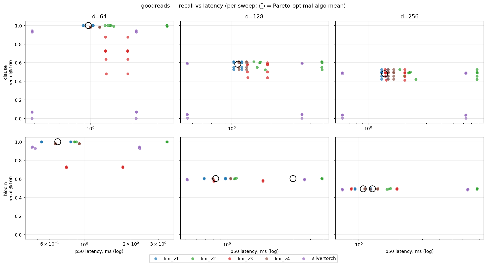
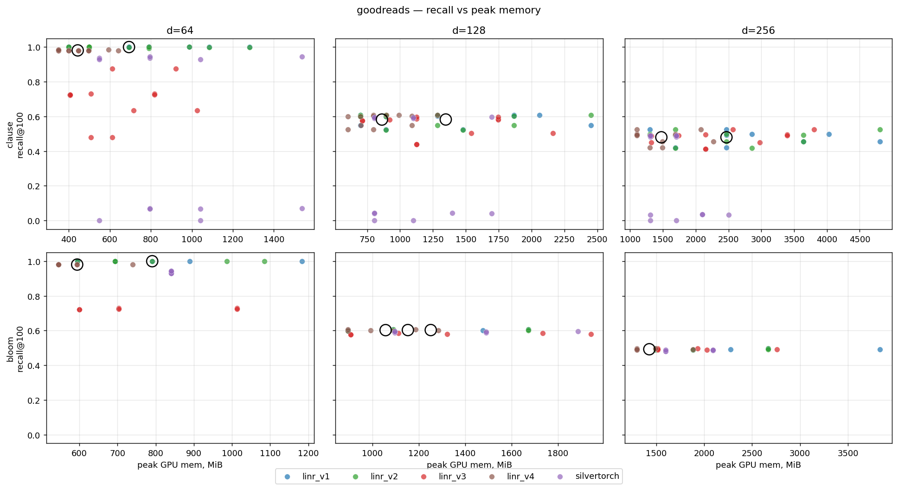
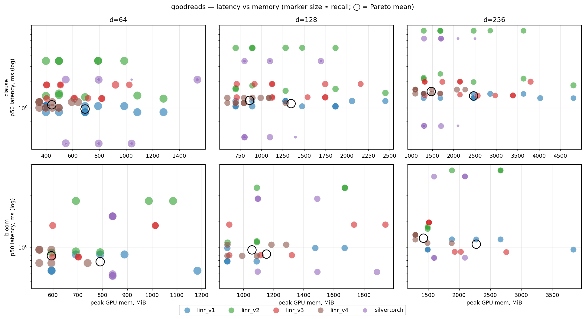
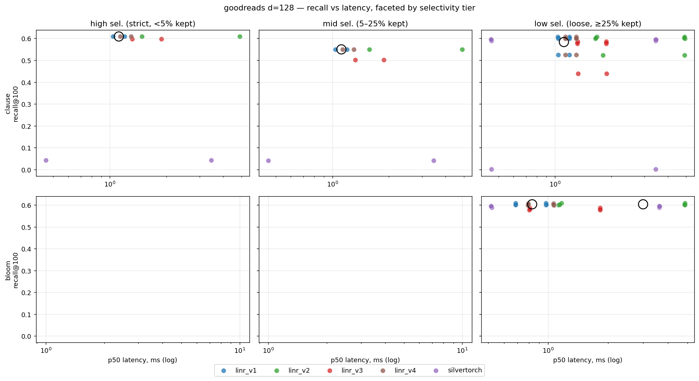
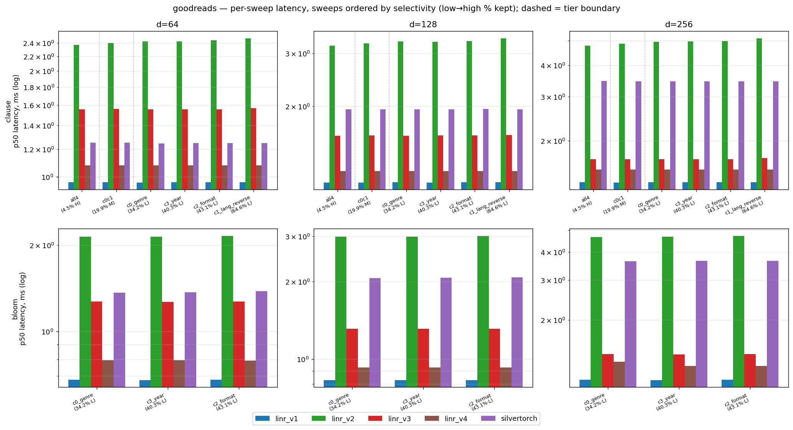

### goodreads · d=64 — by selectivity tier

#### high sel. (strict, <5% kept) — sweeps: `all4` (4.5%)

- **clause** — fastest: `linr_v1` (0.97 ms); best recall: `linr_v1` (0.9994); lowest peak mem: `linr_v4` (471.9 MiB); Pareto: linr_v1.

| filter | algo | recall | ndcg | p50_ms | peak_MiB | idx_MiB | pareto |
| --- | --- | --- | --- | --- | --- | --- | --- |
| clause | linr_v1 | 0.9994 | 0.9996 | 0.9655 | 546.6 | 98.0000 | ★ |
| clause | linr_v4 | 0.9833 | 0.9880 | 1.0790 | 471.9 | 48.6504 |  |
| clause | silvertorch | 0.0667 | 0.0696 | 1.2516 | 918.9 | 255.0 |  |
| clause | linr_v3 | 0.8751 | 0.9075 | 1.5572 | 766.8 | 103.4 |  |
| clause | linr_v2 | 0.9992 | 0.9994 | 2.3700 | 889.6 | 98.0000 |  |

#### mid sel. (5–25% kept) — sweeps: `c0c1` (19.9%)

- **clause** — fastest: `linr_v1` (0.97 ms); best recall: `linr_v1` (0.9994); lowest peak mem: `linr_v4` (544.9 MiB); Pareto: linr_v1.

| filter | algo | recall | ndcg | p50_ms | peak_MiB | idx_MiB | pareto |
| --- | --- | --- | --- | --- | --- | --- | --- |
| clause | linr_v1 | 0.9994 | 0.9996 | 0.9660 | 1134.6 | 98.0000 | ★ |
| clause | linr_v4 | 0.9800 | 0.9856 | 1.0793 | 544.9 | 48.6504 |  |
| clause | silvertorch | 0.0706 | 0.0722 | 1.2507 | 1165.8 | 255.0 |  |
| clause | linr_v3 | 0.6352 | 0.7212 | 1.5616 | 870.2 | 103.4 |  |
| clause | linr_v2 | 0.9992 | 0.9994 | 2.4016 | 840.6 | 98.0000 |  |

#### low sel. (loose, ≥25% kept) — sweeps: `c0_genre` (34.2%), `c3_year` (40.3%), `c2_format` (43.1%), `c1_lang_reverse` (64.6%)

- **clause** — fastest: `linr_v1` (0.97 ms); best recall: `linr_v1` (0.9996); lowest peak mem: `linr_v4` (411.1 MiB); Pareto: linr_v1.
- **bloom** — fastest: `linr_v1` (0.68 ms); best recall: `linr_v1` (0.9996); lowest peak mem: `linr_v4` (594.2 MiB); Pareto: linr_v1.

| filter | algo | recall | ndcg | p50_ms | peak_MiB | idx_MiB | pareto |
| --- | --- | --- | --- | --- | --- | --- | --- |
| clause | linr_v1 | 0.9996 | 0.9997 | 0.9654 | 620.1 | 98.0000 | ★ |
| clause | linr_v4 | 0.9797 | 0.9853 | 1.0794 | 411.1 | 48.6504 |  |
| clause | silvertorch | 0.7021 | 0.7150 | 1.2469 | 857.1 | 254.0 |  |
| clause | linr_v3 | 0.6636 | 0.7407 | 1.5587 | 560.1 | 103.4 |  |
| clause | linr_v2 | 0.9975 | 0.9963 | 2.4430 | 620.1 | 98.0000 |  |
| bloom | linr_v1 | 0.9996 | 0.9997 | 0.6779 | 790.9 | 98.0000 | ★ |
| bloom | linr_v4 | 0.9802 | 0.9857 | 0.7934 | 594.2 | 48.6504 |  |
| bloom | linr_v3 | 0.7254 | 0.7936 | 1.2723 | 771.9 | 103.4 |  |
| bloom | silvertorch | 0.9361 | 0.9533 | 1.3726 | 841.1 | 352.3 |  |
| bloom | linr_v2 | 0.9994 | 0.9996 | 2.1461 | 807.3 | 98.0000 |  |

Per-sweep detail (bs=8, k=100)

| filter | sweep | tier | sel_pct | algo | recall | p50_ms | peak_MiB |
| --- | --- | --- | --- | --- | --- | --- | --- |
| clause | all4 | high | 4.4700 | linr_v1 | 0.9994 | 0.9655 | 546.6 |
| clause | all4 | high | 4.4700 | linr_v2 | 0.9992 | 2.3700 | 889.6 |
| clause | all4 | high | 4.4700 | linr_v3 | 0.8751 | 1.5572 | 766.8 |
| clause | all4 | high | 4.4700 | linr_v4 | 0.9833 | 1.0790 | 471.9 |
| clause | all4 | high | 4.4700 | silvertorch | 0.0667 | 1.2516 | 918.9 |
| clause | c0c1 | mid | 19.9500 | linr_v1 | 0.9994 | 0.9660 | 1134.6 |
| clause | c0c1 | mid | 19.9500 | linr_v2 | 0.9992 | 2.4016 | 840.6 |
| clause | c0c1 | mid | 19.9500 | linr_v3 | 0.6352 | 1.5616 | 870.2 |
| clause | c0c1 | mid | 19.9500 | linr_v4 | 0.9800 | 1.0793 | 544.9 |
| clause | c0c1 | mid | 19.9500 | silvertorch | 0.0706 | 1.2507 | 1165.8 |
| clause | c0_genre | low | 34.1700 | linr_v1 | 0.9996 | 0.9648 | 399.6 |
| clause | c0_genre | low | 34.1700 | linr_v2 | 0.9994 | 2.4277 | 448.6 |
| clause | c0_genre | low | 34.1700 | linr_v3 | 0.7226 | 1.5566 | 405.0 |
| clause | c0_genre | low | 34.1700 | linr_v4 | 0.9801 | 1.0791 | 374.6 |
| clause | c0_genre | low | 34.1700 | silvertorch | 0.9353 | 1.2454 | 672.0 |
| clause | c3_year | low | 40.3000 | linr_v1 | 0.9996 | 0.9656 | 546.6 |
| clause | c3_year | low | 40.3000 | linr_v2 | 0.9994 | 2.4285 | 742.6 |
| clause | c3_year | low | 40.3000 | linr_v3 | 0.7240 | 1.5554 | 611.8 |
| clause | c3_year | low | 40.3000 | linr_v4 | 0.9801 | 1.0791 | 423.2 |
| clause | c3_year | low | 40.3000 | silvertorch | 0.9435 | 1.2463 | 1165.8 |
| clause | c2_format | low | 43.1200 | linr_v1 | 0.9996 | 0.9655 | 938.6 |
| clause | c2_format | low | 43.1200 | linr_v2 | 0.9994 | 2.4418 | 644.6 |
| clause | c2_format | low | 43.1200 | linr_v3 | 0.7294 | 1.5551 | 663.4 |
| clause | c2_format | low | 43.1200 | linr_v4 | 0.9804 | 1.0795 | 423.2 |
| clause | c2_format | low | 43.1200 | silvertorch | 0.9292 | 1.2485 | 795.4 |
| clause | c1_lang_reverse | low | 64.6200 | linr_v1 | 0.9994 | 0.9657 | 595.6 |
| clause | c1_lang_reverse | low | 64.6200 | linr_v2 | 0.9918 | 2.4740 | 644.6 |
| clause | c1_lang_reverse | low | 64.6200 | linr_v3 | 0.4784 | 1.5675 | 560.1 |
| clause | c1_lang_reverse | low | 64.6200 | linr_v4 | 0.9782 | 1.0799 | 423.2 |
| clause | c1_lang_reverse | low | 64.6200 | silvertorch | 0.0002 | 1.2473 | 795.4 |
| bloom | c0_genre | low | 34.1700 | linr_v1 | 0.9996 | 0.6781 | 643.9 |
| bloom | c0_genre | low | 34.1700 | linr_v2 | 0.9994 | 2.1415 | 643.9 |
| bloom | c0_genre | low | 34.1700 | linr_v3 | 0.7227 | 1.2733 | 599.6 |
| bloom | c0_genre | low | 34.1700 | linr_v4 | 0.9801 | 0.7939 | 545.6 |
| bloom | c0_genre | low | 34.1700 | silvertorch | 0.9354 | 1.3666 | 841.1 |
| bloom | c3_year | low | 40.3000 | linr_v1 | 0.9996 | 0.6776 | 986.9 |
| bloom | c3_year | low | 40.3000 | linr_v2 | 0.9994 | 2.1423 | 938.0 |
| bloom | c3_year | low | 40.3000 | linr_v3 | 0.7241 | 1.2706 | 858.1 |
| bloom | c3_year | low | 40.3000 | linr_v4 | 0.9801 | 0.7933 | 642.9 |
| bloom | c3_year | low | 40.3000 | silvertorch | 0.9436 | 1.3699 | 841.1 |
| bloom | c2_format | low | 43.1200 | linr_v1 | 0.9996 | 0.6780 | 741.9 |
| bloom | c2_format | low | 43.1200 | linr_v2 | 0.9994 | 2.1547 | 840.0 |
| bloom | c2_format | low | 43.1200 | linr_v3 | 0.7294 | 1.2731 | 858.1 |
| bloom | c2_format | low | 43.1200 | linr_v4 | 0.9804 | 0.7930 | 594.2 |
| bloom | c2_format | low | 43.1200 | silvertorch | 0.9293 | 1.3812 | 841.1 |

### goodreads · d=128 — by selectivity tier

#### high sel. (strict, <5% kept) — sweeps: `all4` (4.5%)

- **clause** — fastest: `linr_v1` (1.12 ms); best recall: `linr_v1` (0.6089); lowest peak mem: `silvertorch` (1100.6 MiB); Pareto: linr_v1.

| filter | algo | recall | ndcg | p50_ms | peak_MiB | idx_MiB | pareto |
| --- | --- | --- | --- | --- | --- | --- | --- |
| clause | linr_v1 | 0.6089 | 0.6733 | 1.1152 | 1574.6 | 194.6 | ★ |
| clause | linr_v4 | 0.6087 | 0.6731 | 1.2157 | 1138.7 | 97.6992 |  |
| clause | linr_v3 | 0.5979 | 0.6643 | 1.5933 | 1436.6 | 206.8 |  |
| clause | silvertorch | 0.0425 | 0.0477 | 1.9524 | 1100.6 | 306.0 |  |
| clause | linr_v2 | 0.6089 | 0.6733 | 3.1847 | 1672.6 | 194.6 |  |

#### mid sel. (5–25% kept) — sweeps: `c0c1` (19.9%)

- **clause** — fastest: `linr_v1` (1.12 ms); best recall: `linr_v1` (0.5498); lowest peak mem: `linr_v4` (895.0 MiB); Pareto: linr_v1.

| filter | algo | recall | ndcg | p50_ms | peak_MiB | idx_MiB | pareto |
| --- | --- | --- | --- | --- | --- | --- | --- |
| clause | linr_v1 | 0.5498 | 0.6176 | 1.1152 | 1574.6 | 194.6 | ★ |
| clause | linr_v4 | 0.5495 | 0.6174 | 1.2163 | 895.0 | 97.3008 |  |
| clause | linr_v3 | 0.5022 | 0.5779 | 1.5999 | 1851.0 | 207.2 |  |
| clause | silvertorch | 0.0407 | 0.0455 | 1.9537 | 1249.5 | 305.9 |  |
| clause | linr_v2 | 0.5498 | 0.6176 | 3.2369 | 1575.3 | 194.6 |  |

#### low sel. (loose, ≥25% kept) — sweeps: `c0_genre` (34.2%), `c3_year` (40.3%), `c2_format` (43.1%), `c1_lang_reverse` (64.6%)

- **clause** — fastest: `linr_v1` (1.12 ms); best recall: `linr_v1` (0.5834); lowest peak mem: `linr_v4` (784.9 MiB); Pareto: linr_v1.
- **bloom** — fastest: `linr_v1` (0.83 ms); best recall: `linr_v2` (0.6030); lowest peak mem: `linr_v4` (1056.9 MiB); Pareto: linr_v1, linr_v2.

| filter | algo | recall | ndcg | p50_ms | peak_MiB | idx_MiB | pareto |
| --- | --- | --- | --- | --- | --- | --- | --- |
| clause | linr_v1 | 0.5834 | 0.6461 | 1.1154 | 1234.1 | 194.6 | ★ |
| clause | linr_v4 | 0.5830 | 0.6457 | 1.2172 | 784.9 | 97.4004 |  |
| clause | linr_v3 | 0.5458 | 0.6134 | 1.5985 | 1151.9 | 207.0 |  |
| clause | silvertorch | 0.4446 | 0.4916 | 1.9542 | 1026.2 | 304.9 |  |
| clause | linr_v2 | 0.5829 | 0.6443 | 3.3023 | 1064.5 | 194.6 |  |
| bloom | linr_v1 | 0.6030 | 0.6636 | 0.8304 | 1153.0 | 194.6 | ★ |
| bloom | linr_v4 | 0.6025 | 0.6632 | 0.9285 | 1056.9 | 97.3008 |  |
| bloom | linr_v3 | 0.5812 | 0.6459 | 1.3118 | 1320.8 | 207.0 |  |
| bloom | silvertorch | 0.5926 | 0.6553 | 2.0712 | 1359.4 | 403.8 |  |
| bloom | linr_v2 | 0.6030 | 0.6636 | 2.9977 | 1251.7 | 194.6 | ★ |

Per-sweep detail (bs=8, k=100)

| filter | sweep | tier | sel_pct | algo | recall | p50_ms | peak_MiB |
| --- | --- | --- | --- | --- | --- | --- | --- |
| clause | all4 | high | 4.4700 | linr_v1 | 0.6089 | 1.1152 | 1574.6 |
| clause | all4 | high | 4.4700 | linr_v2 | 0.6089 | 3.1847 | 1672.6 |
| clause | all4 | high | 4.4700 | linr_v3 | 0.5979 | 1.5933 | 1436.6 |
| clause | all4 | high | 4.4700 | linr_v4 | 0.6087 | 1.2157 | 1138.7 |
| clause | all4 | high | 4.4700 | silvertorch | 0.0425 | 1.9524 | 1100.6 |
| clause | c0c1 | mid | 19.9500 | linr_v1 | 0.5498 | 1.1152 | 1574.6 |
| clause | c0c1 | mid | 19.9500 | linr_v2 | 0.5498 | 3.2369 | 1575.3 |
| clause | c0c1 | mid | 19.9500 | linr_v3 | 0.5022 | 1.5999 | 1851.0 |
| clause | c0c1 | mid | 19.9500 | linr_v4 | 0.5495 | 1.2163 | 895.0 |
| clause | c0c1 | mid | 19.9500 | silvertorch | 0.0407 | 1.9537 | 1249.5 |
| clause | c0_genre | low | 34.1700 | linr_v1 | 0.5994 | 1.1155 | 796.2 |
| clause | c0_genre | low | 34.1700 | linr_v2 | 0.5994 | 3.2818 | 796.9 |
| clause | c0_genre | low | 34.1700 | linr_v3 | 0.5768 | 1.5952 | 711.8 |
| clause | c0_genre | low | 34.1700 | linr_v4 | 0.5990 | 1.2168 | 651.0 |
| clause | c0_genre | low | 34.1700 | silvertorch | 0.5890 | 1.9530 | 951.7 |
| clause | c3_year | low | 40.3000 | linr_v1 | 0.6020 | 1.1152 | 1574.6 |
| clause | c3_year | low | 40.3000 | linr_v2 | 0.6020 | 3.2735 | 1283.4 |
| clause | c3_year | low | 40.3000 | linr_v3 | 0.5806 | 1.5965 | 1333.3 |
| clause | c3_year | low | 40.3000 | linr_v4 | 0.6016 | 1.2171 | 943.3 |
| clause | c3_year | low | 40.3000 | silvertorch | 0.5956 | 1.9527 | 1249.5 |
| clause | c2_format | low | 43.1200 | linr_v1 | 0.6075 | 1.1155 | 1380.0 |
| clause | c2_format | low | 43.1200 | linr_v2 | 0.6075 | 3.2922 | 991.5 |
| clause | c2_format | low | 43.1200 | linr_v3 | 0.5863 | 1.5978 | 1436.6 |
| clause | c2_format | low | 43.1200 | linr_v4 | 0.6071 | 1.2175 | 846.0 |
| clause | c2_format | low | 43.1200 | silvertorch | 0.5934 | 1.9573 | 951.7 |
| clause | c1_lang_reverse | low | 64.6200 | linr_v1 | 0.5248 | 1.1155 | 1185.4 |
| clause | c1_lang_reverse | low | 64.6200 | linr_v2 | 0.5225 | 3.3618 | 1186.1 |
| clause | c1_lang_reverse | low | 64.6200 | linr_v3 | 0.4397 | 1.6045 | 1126.1 |
| clause | c1_lang_reverse | low | 64.6200 | linr_v4 | 0.5243 | 1.2174 | 699.6 |
| clause | c1_lang_reverse | low | 64.6200 | silvertorch | 0.0005 | 1.9537 | 951.7 |
| bloom | c0_genre | low | 34.1700 | linr_v1 | 0.5994 | 0.8304 | 893.5 |
| bloom | c0_genre | low | 34.1700 | linr_v2 | 0.5994 | 2.9914 | 992.2 |
| bloom | c0_genre | low | 34.1700 | linr_v3 | 0.5768 | 1.3115 | 906.5 |
| bloom | c0_genre | low | 34.1700 | linr_v4 | 0.5990 | 0.9287 | 992.0 |
| bloom | c0_genre | low | 34.1700 | silvertorch | 0.5890 | 2.0685 | 1293.0 |
| bloom | c3_year | low | 40.3000 | linr_v1 | 0.6020 | 0.8304 | 1185.4 |
| bloom | c3_year | low | 40.3000 | linr_v2 | 0.6020 | 2.9914 | 1381.5 |
| bloom | c3_year | low | 40.3000 | linr_v3 | 0.5806 | 1.3120 | 1632.2 |
| bloom | c3_year | low | 40.3000 | linr_v4 | 0.6016 | 0.9284 | 1138.4 |
| bloom | c3_year | low | 40.3000 | silvertorch | 0.5956 | 2.0691 | 1491.4 |
| bloom | c2_format | low | 43.1200 | linr_v1 | 0.6075 | 0.8303 | 1380.0 |
| bloom | c2_format | low | 43.1200 | linr_v2 | 0.6075 | 3.0103 | 1381.5 |
| bloom | c2_format | low | 43.1200 | linr_v3 | 0.5863 | 1.3120 | 1423.8 |
| bloom | c2_format | low | 43.1200 | linr_v4 | 0.6071 | 0.9284 | 1040.3 |
| bloom | c2_format | low | 43.1200 | silvertorch | 0.5933 | 2.0759 | 1293.8 |

### goodreads · d=256 — by selectivity tier

#### high sel. (strict, <5% kept) — sweeps: `all4` (4.5%)

- **clause** — fastest: `linr_v1` (1.37 ms); best recall: `linr_v2` (0.5257); lowest peak mem: `linr_v4` (1590.5 MiB); Pareto: linr_v1, linr_v2.

| filter | algo | recall | ndcg | p50_ms | peak_MiB | idx_MiB | pareto |
| --- | --- | --- | --- | --- | --- | --- | --- |
| clause | linr_v1 | 0.5257 | 0.5915 | 1.3672 | 1884.4 | 390.0 | ★ |
| clause | linr_v4 | 0.5256 | 0.5914 | 1.5376 | 1590.5 | 194.6 |  |
| clause | linr_v3 | 0.5250 | 0.5909 | 1.6877 | 3183.8 | 413.5 |  |
| clause | silvertorch | 0.0357 | 0.0409 | 3.4569 | 2103.4 | 406.1 |  |
| clause | linr_v2 | 0.5257 | 0.5915 | 4.7766 | 3249.4 | 390.0 | ★ |

#### mid sel. (5–25% kept) — sweeps: `c0c1` (19.9%)

- **clause** — fastest: `linr_v1` (1.37 ms); best recall: `linr_v1` (0.4542); lowest peak mem: `linr_v4` (1882.4 MiB); Pareto: linr_v1.

| filter | algo | recall | ndcg | p50_ms | peak_MiB | idx_MiB | pareto |
| --- | --- | --- | --- | --- | --- | --- | --- |
| clause | linr_v1 | 0.4542 | 0.5201 | 1.3660 | 4224.4 | 390.0 | ★ |
| clause | linr_v4 | 0.4542 | 0.5201 | 1.5376 | 1882.4 | 194.6 |  |
| clause | linr_v3 | 0.4508 | 0.5174 | 1.6883 | 2150.0 | 413.5 |  |
| clause | silvertorch | 0.0335 | 0.0380 | 3.4460 | 1904.4 | 406.1 |  |
| clause | linr_v2 | 0.4542 | 0.5201 | 4.8666 | 3054.4 | 390.0 |  |

#### low sel. (loose, ≥25% kept) — sweeps: `c0_genre` (34.2%), `c3_year` (40.3%), `c2_format` (43.1%), `c1_lang_reverse` (64.6%)

- **clause** — fastest: `linr_v1` (1.37 ms); best recall: `linr_v4` (0.4745); lowest peak mem: `linr_v4` (1347.3 MiB); Pareto: linr_v1, linr_v4.
- **bloom** — fastest: `linr_v1` (1.08 ms); best recall: `linr_v4` (0.4924); lowest peak mem: `linr_v4` (1427.7 MiB); Pareto: linr_v1, linr_v4.

| filter | algo | recall | ndcg | p50_ms | peak_MiB | idx_MiB | pareto |
| --- | --- | --- | --- | --- | --- | --- | --- |
| clause | linr_v1 | 0.4745 | 0.5359 | 1.3678 | 2176.9 | 390.0 | ★ |
| clause | linr_v4 | 0.4745 | 0.5360 | 1.5380 | 1347.3 | 194.6 | ★ |
| clause | linr_v3 | 0.4716 | 0.5328 | 1.6942 | 2201.7 | 413.5 |  |
| clause | silvertorch | 0.3645 | 0.4110 | 3.4498 | 1506.4 | 405.1 |  |
| clause | linr_v2 | 0.4740 | 0.5347 | 5.0050 | 2030.7 | 390.0 |  |
| bloom | linr_v1 | 0.4924 | 0.5523 | 1.0817 | 2275.4 | 390.0 | ★ |
| bloom | linr_v4 | 0.4924 | 0.5524 | 1.2669 | 1427.7 | 194.6 | ★ |
| bloom | linr_v3 | 0.4915 | 0.5517 | 1.4045 | 1877.8 | 413.5 |  |
| bloom | silvertorch | 0.4859 | 0.5479 | 3.6514 | 1846.3 | 503.4 |  |
| bloom | linr_v2 | 0.4924 | 0.5523 | 4.6868 | 1950.4 | 390.0 |  |

Per-sweep detail (bs=8, k=100)

| filter | sweep | tier | sel_pct | algo | recall | p50_ms | peak_MiB |
| --- | --- | --- | --- | --- | --- | --- | --- |
| clause | all4 | high | 4.4700 | linr_v1 | 0.5257 | 1.3672 | 1884.4 |
| clause | all4 | high | 4.4700 | linr_v2 | 0.5257 | 4.7766 | 3249.4 |
| clause | all4 | high | 4.4700 | linr_v3 | 0.5250 | 1.6877 | 3183.8 |
| clause | all4 | high | 4.4700 | linr_v4 | 0.5256 | 1.5376 | 1590.5 |
| clause | all4 | high | 4.4700 | silvertorch | 0.0357 | 3.4569 | 2103.4 |
| clause | c0c1 | mid | 19.9500 | linr_v1 | 0.4542 | 1.3660 | 4224.4 |
| clause | c0c1 | mid | 19.9500 | linr_v2 | 0.4542 | 4.8666 | 3054.4 |
| clause | c0c1 | mid | 19.9500 | linr_v3 | 0.4508 | 1.6883 | 2150.0 |
| clause | c0c1 | mid | 19.9500 | linr_v4 | 0.4542 | 1.5376 | 1882.4 |
| clause | c0c1 | mid | 19.9500 | silvertorch | 0.0335 | 3.4460 | 1904.4 |
| clause | c0_genre | low | 34.1700 | linr_v1 | 0.4887 | 1.3683 | 1299.4 |
| clause | c0_genre | low | 34.1700 | linr_v2 | 0.4887 | 4.9572 | 1494.4 |
| clause | c0_genre | low | 34.1700 | linr_v3 | 0.4879 | 1.6909 | 1322.9 |
| clause | c0_genre | low | 34.1700 | linr_v4 | 0.4887 | 1.5376 | 1201.3 |
| clause | c0_genre | low | 34.1700 | silvertorch | 0.4812 | 3.4524 | 1506.4 |
| clause | c3_year | low | 40.3000 | linr_v1 | 0.4915 | 1.3667 | 1884.4 |
| clause | c3_year | low | 40.3000 | linr_v2 | 0.4915 | 4.9647 | 2469.4 |
| clause | c3_year | low | 40.3000 | linr_v3 | 0.4908 | 1.6871 | 2563.5 |
| clause | c3_year | low | 40.3000 | linr_v4 | 0.4915 | 1.5379 | 1395.9 |
| clause | c3_year | low | 40.3000 | silvertorch | 0.4891 | 3.4491 | 1506.4 |
| clause | c2_format | low | 43.1200 | linr_v1 | 0.4969 | 1.3688 | 3444.4 |
| clause | c2_format | low | 43.1200 | linr_v2 | 0.4969 | 4.9865 | 1884.4 |
| clause | c2_format | low | 43.1200 | linr_v3 | 0.4959 | 1.6927 | 2770.3 |
| clause | c2_format | low | 43.1200 | linr_v4 | 0.4970 | 1.5384 | 1395.9 |
| clause | c2_format | low | 43.1200 | silvertorch | 0.4873 | 3.4477 | 1506.4 |
| clause | c1_lang_reverse | low | 64.6200 | linr_v1 | 0.4210 | 1.3676 | 2079.4 |
| clause | c1_lang_reverse | low | 64.6200 | linr_v2 | 0.4190 | 5.1116 | 2274.4 |
| clause | c1_lang_reverse | low | 64.6200 | linr_v3 | 0.4119 | 1.7061 | 2150.0 |
| clause | c1_lang_reverse | low | 64.6200 | linr_v4 | 0.4209 | 1.5380 | 1395.9 |
| clause | c1_lang_reverse | low | 64.6200 | silvertorch | 0.0006 | 3.4500 | 1506.4 |
| bloom | c0_genre | low | 34.1700 | linr_v1 | 0.4887 | 1.0832 | 1690.4 |
| bloom | c0_genre | low | 34.1700 | linr_v2 | 0.4887 | 4.6615 | 1690.4 |
| bloom | c0_genre | low | 34.1700 | linr_v3 | 0.4879 | 1.4060 | 1772.6 |
| bloom | c0_genre | low | 34.1700 | linr_v4 | 0.4887 | 1.3045 | 1297.9 |
| bloom | c0_genre | low | 34.1700 | silvertorch | 0.4815 | 3.6439 | 1598.6 |
| bloom | c3_year | low | 40.3000 | linr_v1 | 0.4915 | 1.0804 | 3055.4 |
| bloom | c3_year | low | 40.3000 | linr_v2 | 0.4915 | 4.6840 | 2080.4 |
| bloom | c3_year | low | 40.3000 | linr_v3 | 0.4908 | 1.4013 | 2137.2 |
| bloom | c3_year | low | 40.3000 | linr_v4 | 0.4915 | 1.2482 | 1589.8 |
| bloom | c3_year | low | 40.3000 | silvertorch | 0.4890 | 3.6531 | 1846.3 |
| bloom | c2_format | low | 43.1200 | linr_v1 | 0.4969 | 1.0815 | 2080.4 |
| bloom | c2_format | low | 43.1200 | linr_v2 | 0.4969 | 4.7150 | 2080.4 |
| bloom | c2_format | low | 43.1200 | linr_v3 | 0.4959 | 1.4062 | 1723.6 |
| bloom | c2_format | low | 43.1200 | linr_v4 | 0.4970 | 1.2481 | 1395.2 |
| bloom | c2_format | low | 43.1200 | silvertorch | 0.4873 | 3.6573 | 2094.0 |

